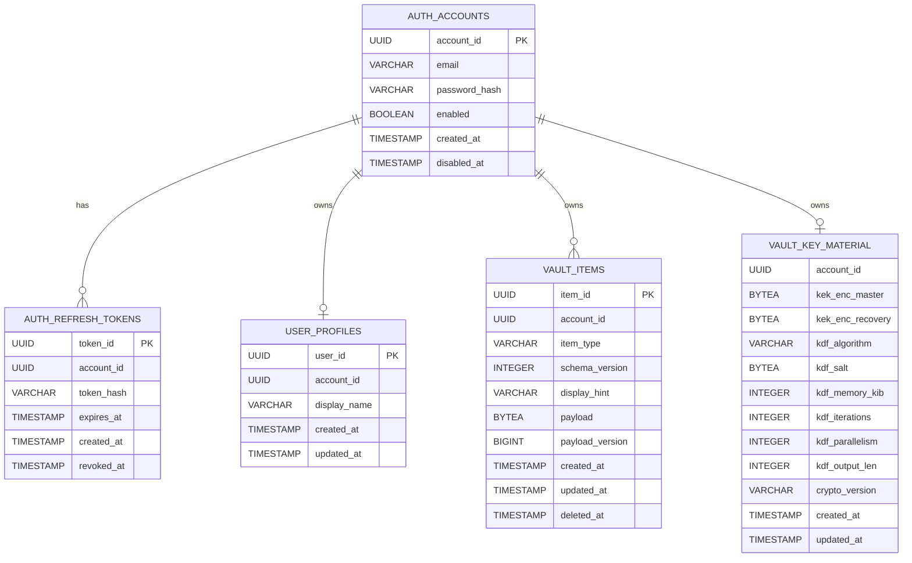

# Database Strategy – SafeCube Backend

Este documento define la **estrategia de base de datos** del backend de SafeCube, incluyendo principios de diseño,
responsabilidades por slice y el esquema actual soportado.

---

## 1. Principios de Diseño

La base de datos de SafeCube sigue los siguientes principios:

* **Single Source of Truth**: el esquema SQL es la referencia definitiva del modelo persistente.
* **Explicit lifecycle**: los estados relevantes (enabled, revoked, expired, disabled) se representan explícitamente
  mediante columnas.
* **No implicit deletes**: no se utilizan borrados lógicos implícitos salvo decisión explícita documentada.
* **Infrastructure-agnostic domain**: el dominio no depende de JPA ni de detalles de persistencia.

---

## 2. Estrategia de Entornos

### 2.1 Local Development

* Base de datos PostgreSQL levantada vía **docker-compose**.
* Inicialización mediante `docker/postgres/init-schema.sql`.

### 2.2 Tests (Integration / Acceptance)

* Uso de **Testcontainers**.
* El esquema se copia automáticamente durante el build y se monta como script de inicialización.
* No existen migraciones dinámicas en tests.

### 2.3 Producción

* La base de datos se gestiona de forma **manual/administrada**.
* Alojada en un servidor web dedicado.
* No se ejecutan scripts automáticos desde la aplicación.

---

## 3. Esquema Actual (v1)

### 3.1 auth_accounts

```sql
CREATE TABLE IF NOT EXISTS auth_accounts (
    account_id UUID PRIMARY KEY,
    email VARCHAR (255) NOT NULL UNIQUE,
    password_hash VARCHAR(255) NOT NULL,
    enabled BOOLEAN NOT NULL,
    created_at TIMESTAMP WITH TIME ZONE NOT NULL,
    disabled_at TIMESTAMP WITH TIME ZONE
);
```

Responsabilidad:

* Representa la **identidad autenticable**.
* Controla si una cuenta puede autenticarse (`enabled`).

---

### 3.2 auth_refresh_tokens

```sql
CREATE TABLE IF NOT EXISTS auth_refresh_tokens (
    token_id UUID PRIMARY KEY, 
    account_id UUID NOT NULL, 
    token_hash VARCHAR( 255 ) NOT NULL UNIQUE, 
    expires_at TIMESTAMP WITH TIME ZONE NOT NULL, 
    created_at TIMESTAMP WITH TIME ZONE NOT NULL, 
    revoked_at TIMESTAMP WITH TIME ZONE
);

CREATE INDEX IF NOT EXISTS idx_auth_refresh_tokens_account_id
    ON auth_refresh_tokens (account_id);

CREATE INDEX IF NOT EXISTS idx_auth_refresh_tokens_expires_at
    ON auth_refresh_tokens (expires_at);
```

Responsabilidad:

* Persistencia de refresh tokens.
* Soporta rotación, revocación y expiración explícita.

---

### 3.3 user_profiles

```sql
CREATE TABLE IF NOT EXISTS user_profiles (
    user_id UUID PRIMARY KEY, a
    ccount_id UUID NOT NULL UNIQUE, 
    display_name VARCHAR ( 100 ) NOT NULL, 
    created_at TIMESTAMP WITH TIME ZONE NOT NULL, 
    updated_at TIMESTAMP WITH TIME ZONE NOT NULL
);
```

Responsabilidad:

* Información de perfil **no sensible**.
* Relación 1:1 con `auth_accounts`.

---

### 3.4 vault_items

```sql
CREATE TABLE IF NOT EXISTS vault_items (
    item_id UUID PRIMARY KEY, 
    account_id UUID NOT NULL, 
    item_type VARCHAR (50) NOT NULL, 
    schema_version INTEGER NOT NULL, 
    display_hint VARCHAR(255) NOT NULL, 
    payload BYTEA NOT NULL, 
    payload_version BIGINT NOT NULL, 
    created_at TIMESTAMP WITH TIME ZONE NOT NULL, 
    updated_at TIMESTAMP WITH TIME ZONE NOT NULL, 
    deleted_at TIMESTAMP WITH TIME ZONE
);

   CREATE INDEX IF NOT EXISTS idx_vault_items_account_id ON vault_items (account_id);
   CREATE INDEX IF NOT EXISTS idx_vault_items_updated_at ON vault_items (updated_at);
   CREATE INDEX IF NOT EXISTS idx_vault_items_deleted_at ON vault_items (deleted_at);
```

Responsabilidad:

- Persistencia de secretos cifrados (opaque payloads).
- Aislamiento estricto por account_id.
- Soporte de sincronización mediante timestamps.
- Implementa borrado lógico explícito (deleted_at).

---

### 3.5 vault_key_material

```sql
CREATE TABLE IF NOT EXISTS vault_key_material(
    account_id UUID PRIMARY KEY,
    kek_enc_master BYTEA NOT NULL,
    kek_enc_recovery BYTEA NOT NULL,
    kdf_algorithm VARCHAR (50) NOT NULL,
    kdf_salt BYTEA NOT NULL,
    kdf_memory_kib INTEGER NOT NULL,
    kdf_iterations INTEGER NOT NULL,
    kdf_parallelism INTEGER NOT NULL,
    kdf_output_len INTEGER NOT NULL,
    crypto_version VARCHAR (50) NOT NULL,
    created_at TIMESTAMP WITH TIME ZONE NOT NULL,
    updated_at TIMESTAMP WITH TIME ZONE NOT NULL,
    CONSTRAINT fk_vault_key_material_account
    FOREIGN KEY (account_id)
    REFERENCES auth_accounts(account_id)
    ON DELETE CASCADE
);
```

Responsabilidad:

- Almacena el material criptográfico necesario para desbloquear el vault de un account
- Backend no puede derivar claves ni descifrar contenido. Todo el material se almacena como blobs opacos.

---

## 4. Relaciones Entre Tablas

* auth_accounts (1) —— (0..*) auth_refresh_tokens
* auth_accounts (1) —— (0..1) user_profiles
* auth_accounts (1) —— (0..*) vault_items
* auth_accounts (1) ── (1) vault_key_material

> La relación entre `auth_accounts` y `vault_items` se refuerza mediante una
> foreign key física en el esquema actual.

---

## 5. ERD (Entity Relationship Diagram)



---

## 6. Decisiones Explícitas

* Las relaciones de propiedad se refuerzan mediante `FOREIGN KEY` y acciones `ON DELETE` explícitas.
* No existe `deleted_at` en tablas de identidad (`auth`, `user`).
* El slice `vault` implementa borrado lógico explícito (`deleted_at`)
  para soportar sincronización entre clientes.
* No hay migraciones automáticas (Flyway/Liquibase) en v1.
* El esquema evoluciona mediante decisiones arquitectónicas documentadas (ADR).
* El slice `vault` utiliza timestamps (`created_at`, `updated_at`, `deleted_at`)
  como mecanismo de sincronización y concurrencia.
* No se utilizan locks ni versionado optimista JPA.

---

## 7. Seguridad de acceso y Supabase

Las siete tablas de SafeCube en el esquema `public` son:

* `auth_accounts`
* `auth_refresh_tokens`
* `user_profiles`
* `vault_item_change_cursors`
* `vault_items`
* `vault_item_mutations`
* `vault_key_material`

Todas tienen RLS habilitada en `docker/postgres/init-schema.sql`. No se crean
políticas RLS: los roles sujetos a RLS quedan denegados por defecto. SafeCube no
usa Supabase Auth, `auth.uid()` ni la Data API de Supabase.

El backend utiliza un rol JDBC privado `safecube_app`, que:

* puede iniciar sesión, no es superusuario y no es propietario de las tablas;
* tiene `BYPASSRLS` porque la autorización funcional se realiza en Spring Boot
  con el `accountId` del JWT propio;
* recibe únicamente `USAGE` sobre `public` y `SELECT`, `INSERT` y `UPDATE` según
  la matriz real de repositorios;
* no recibe `DELETE`, `TRUNCATE`, `REFERENCES`, `TRIGGER` ni `CREATE`.

El script `docker/postgres/supabase-security.sql` revoca explícitamente los
privilegios de `anon`, `authenticated`, `service_role` y `PUBLIC` sobre las
tablas de SafeCube. También revoca esos permisos por defecto para objetos nuevos.
Debe ejecutarse con el rol que crea las tablas; en Supabase normalmente es
`postgres`. La contraseña de `safecube_app` se configura fuera del repositorio.

En Koyeb la aplicación se configura con `DATABASE_URL`, `DATABASE_USERNAME` y
`DATABASE_PASSWORD`. La URL JDBC debe incluir `sslmode=require`, debe utilizar
conexión directa o Supavisor en session mode, y nunca debe usar el usuario
`postgres`, `SUPABASE_ANON_KEY` ni `SUPABASE_SERVICE_ROLE_KEY`.

Después de reconstruir la base de datos se deben repetir las comprobaciones de
RLS, privilegios de la Data API, atributos del rol, propietarios de tablas y
Security Advisor descritas en el runbook operativo.

---

## 8. Evolución Futura

Posibles extensiones futuras:

* FK opcionales cuando el modelo se estabilice.
* Tablas de auditoría.
* Estrategia de borrado orquestado (GDPR).

---

> **Regla de oro**: la base de datos refleja estados reales del sistema, no suposiciones implícitas.
