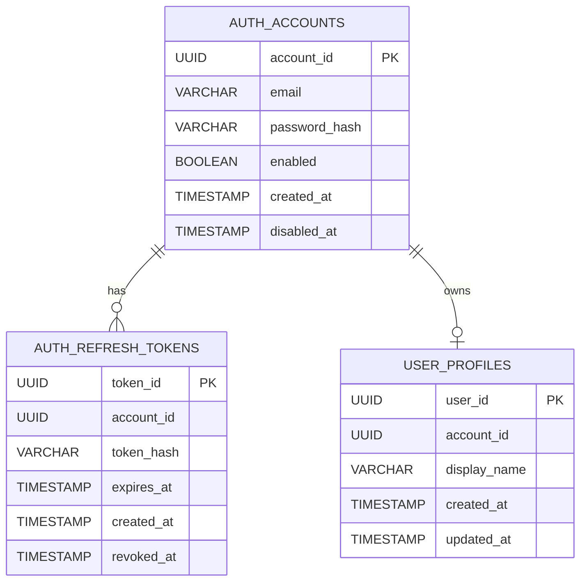

# Database Strategy – SafeCube Backend

Este documento define la **estrategia de base de datos** del backend de SafeCube, incluyendo principios de diseño, responsabilidades por slice y el esquema actual soportado.

---

## 1. Principios de Diseño

La base de datos de SafeCube sigue los siguientes principios:

* **Single Source of Truth**: el esquema SQL es la referencia definitiva del modelo persistente.
* **Explicit lifecycle**: los estados relevantes (enabled, revoked, expired, disabled) se representan explícitamente mediante columnas.
* **No implicit deletes**: no se utilizan borrados lógicos implícitos salvo decisión explícita documentada.
* **Infrastructure-agnostic domain**: el dominio no depende de JPA ni de detalles de persistencia.

---

## 2. Estrategia de Entornos

### 2.1 Local Development

* Base de datos PostgreSQL levantada vía **docker-compose**.
* Inicialización mediante `docker/postgres/init-schema.sql`.

### 2.2 Tests (Integration / Acceptance)

* Uso de **Testcontainers**.
* El esquema se copia automáticamente durante el build y se monta como script de inicialización.
* No existen migraciones dinámicas en tests.

### 2.3 Producción

* La base de datos se gestiona de forma **manual/administrada**.
* Alojada en un servidor web dedicado.
* No se ejecutan scripts automáticos desde la aplicación.

---

## 3. Esquema Actual (v1)

### 3.1 auth_accounts

```sql
CREATE TABLE IF NOT EXISTS auth_accounts (
    account_id UUID PRIMARY KEY,
    email VARCHAR(255) NOT NULL UNIQUE,
    password_hash VARCHAR(255) NOT NULL,
    enabled BOOLEAN NOT NULL,
    created_at TIMESTAMP WITH TIME ZONE NOT NULL,
    disabled_at TIMESTAMP WITH TIME ZONE
);
```

Responsabilidad:

* Representa la **identidad autenticable**.
* Controla si una cuenta puede autenticarse (`enabled`).

---

### 3.2 auth_refresh_tokens

```sql
CREATE TABLE IF NOT EXISTS auth_refresh_tokens (
    token_id UUID PRIMARY KEY,
    account_id UUID NOT NULL,
    token_hash VARCHAR(255) NOT NULL UNIQUE,
    expires_at TIMESTAMP WITH TIME ZONE NOT NULL,
    created_at TIMESTAMP WITH TIME ZONE NOT NULL,
    revoked_at TIMESTAMP WITH TIME ZONE
);

CREATE INDEX IF NOT EXISTS idx_auth_refresh_tokens_account_id
    ON auth_refresh_tokens (account_id);

CREATE INDEX IF NOT EXISTS idx_auth_refresh_tokens_expires_at
    ON auth_refresh_tokens (expires_at);
```

Responsabilidad:

* Persistencia de refresh tokens.
* Soporta rotación, revocación y expiración explícita.

---

### 3.3 user_profiles

```sql
CREATE TABLE IF NOT EXISTS user_profiles (
    user_id UUID PRIMARY KEY,
    account_id UUID NOT NULL UNIQUE,
    display_name VARCHAR(100) NOT NULL,
    created_at TIMESTAMP WITH TIME ZONE NOT NULL,
    updated_at TIMESTAMP WITH TIME ZONE NOT NULL
);
```

Responsabilidad:

* Información de perfil **no sensible**.
* Relación 1:1 con `auth_accounts`.

---

## 4. Relaciones Entre Tablas

* `auth_accounts (1) —— (0..*) auth_refresh_tokens`
* `auth_accounts (1) —— (0..1) user_profiles`

Las relaciones se aplican a nivel **lógico**, no mediante foreign keys estrictas en v1, para mantener bajo acoplamiento entre slices.

---

## 5. ERD (Entity Relationship Diagram)



---

## 6. Decisiones Explícitas

* No existen `FOREIGN KEY` físicas en v1.
* No existe `deleted_at` en ninguna tabla.
* No hay migraciones automáticas (Flyway/Liquibase) en v1.
* El esquema evoluciona mediante decisiones arquitectónicas documentadas (ADR).

---

## 7. Evolución Futura

Posibles extensiones futuras:

* FK opcionales cuando el modelo se estabilice.
* Tablas de auditoría.
* Estrategia de borrado orquestado (GDPR).

---

> **Regla de oro**: la base de datos refleja estados reales del sistema, no suposiciones implícitas.
