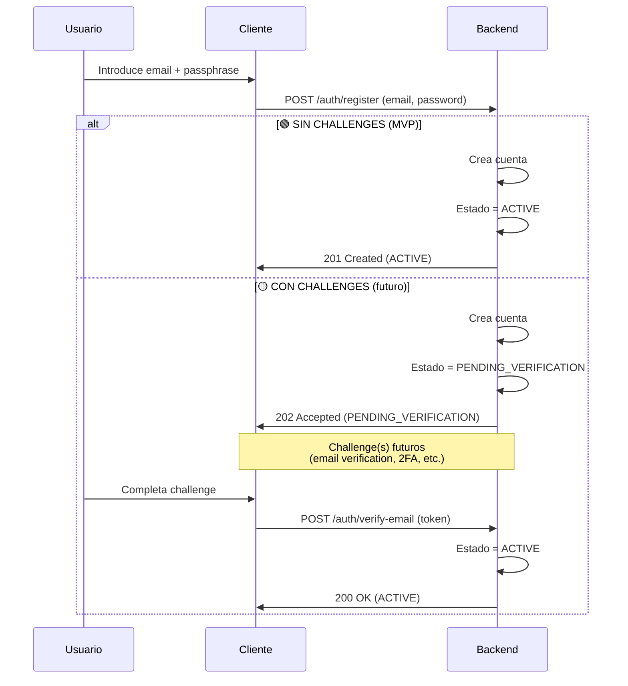
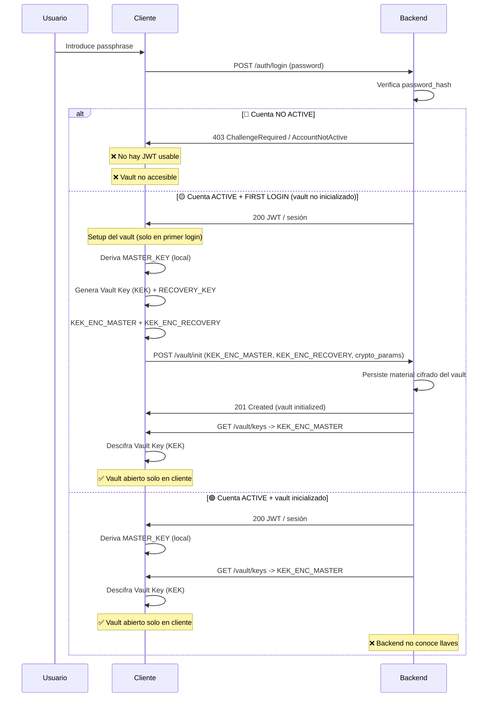
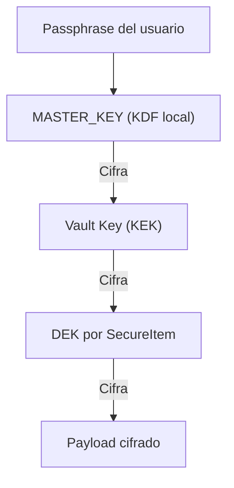
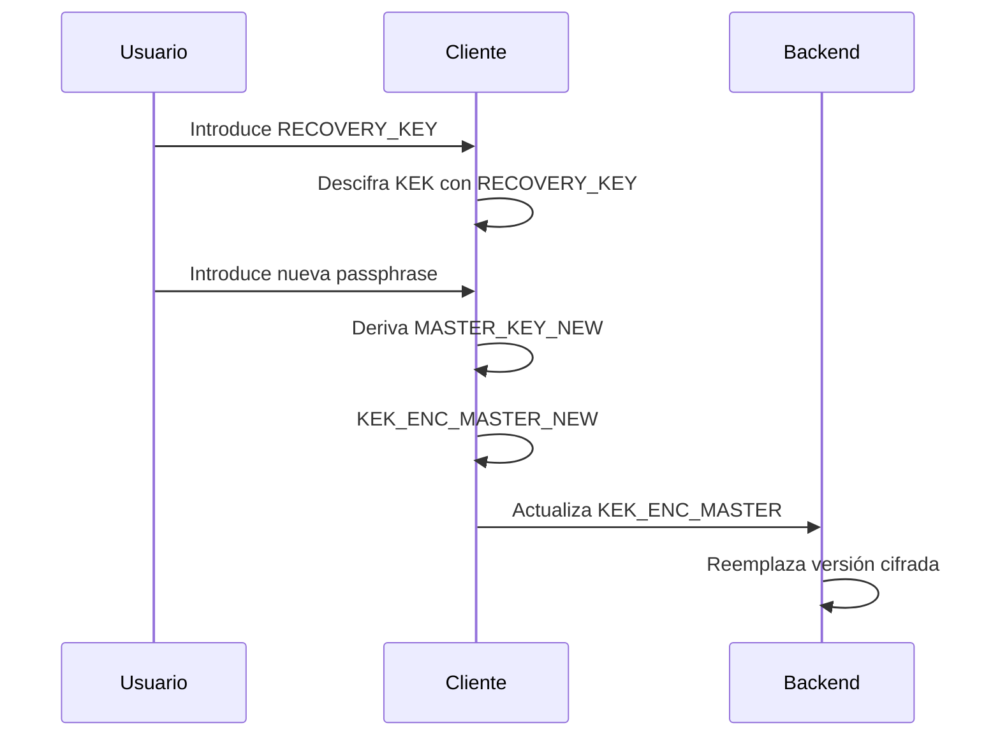

# ADR-004: Vault Data, Crypto & Recovery Strategy

- **Estado**: Accepted
- **Fecha**: 2026-01-17
- **Decisores**: SafeCube Backend
- **Slices afectados**: `vault`, `auth`

---

## Contexto

El slice `vault` es el núcleo funcional de SafeCube. Su objetivo es permitir el almacenamiento y sincronización de secretos de forma segura, manteniendo un modelo **Zero-Knowledge real**, sin sacrificar usabilidad básica ni capacidad de recuperación razonable.

Durante el diseño se identificaron varias áreas críticas que debían cerrarse **antes de implementar código**:

- Modelo criptográfico cliente/backend
- Uso de la passphrase del usuario
- Recuperación ante pérdida de contraseña
- Concurrencia y sincronización
- Borrado de datos
- Filtros y ordenación para UX

Este ADR consolida todas las decisiones acordadas.

---

## Decisión 1 — Separación Login vs Vault Unlock y estado de cuenta

La **passphrase del usuario** cumple dos roles distintos, y su uso está condicionado al **estado de la cuenta**.

- **Login (auth)**

  - La passphrase se envía al backend por HTTPS
  - Se usa exclusivamente para autenticación
  - Se almacena como `password_hash`
  - El login puede quedar **bloqueado o limitado** si la cuenta no está validada

- **Vault Unlock (crypto)**

  - La misma passphrase se usa **solo en cliente**
  - Se deriva una `MASTER_KEY` mediante KDF
  - La `MASTER_KEY` **nunca sale del cliente**
  - El vault \*\*solo\*\* puede inicializarse o abrirse cuando la cuenta está en estado \`ACTIVE\`

Se introduce el concepto de **estado de cuenta** para permitir flujos futuros como:

- Verificación de email
- 2FA / MFA
- Account recovery asistido
- Otros challenges de seguridad

Estados conceptuales iniciales:

- `PENDING_VERIFICATION`
- `ACTIVE`
- `SUSPENDED`
- `DISABLED`

> Login ≠ Vault unlock, y ambos dependen del estado de la cuenta.

Nota: queda fuera de MVP el manejo de los challenge, por defecto al hacer el registro se dejará automaticamente el estado del AuthAccount como `ACTIVE`. Posteriormente cuando dichos challenge se desarrollen, ya se verá.

### Esquema de Register (cuenta pendiente + activación + inicialización de vault)

### Esquema de Login / Uso diario

---

## Decisión 2 — Modelo Criptográfico (Zero-Knowledge)

### Responsabilidades

**Cliente**:

- Deriva `MASTER_KEY` desde la passphrase
- Genera llaves criptográficas
- Cifra y descifra todos los secretos
- Nunca envía llaves en claro

**Backend**:

- Autentica y autoriza
- Persiste material cifrado
- Define versiones y parámetros criptográficos
- Nunca puede descifrar el vault

---

## Decisión 3 — Llaves y jerarquía

### Tipos de llaves

- **MASTER\_KEY**

  - Derivada en cliente desde passphrase
  - Nunca persistida ni enviada

- **KEK (Key Encryption Key / Vault Key)**

  - Generada en cliente
  - 1 por cuenta
  - Cifrada con `MASTER_KEY`
  - Backend solo almacena `KEK_ENC_MASTER`

- **DEK (Data Encryption Key)**

  - Generada en cliente
  - 1 por `SecureItem`
  - Cifra el payload
  - Se cifra con la KEK

### Esquema de jerarquía de llaves

El backend **no genera ni conoce ninguna llave en claro**.

---

## Decisión 4 — Recovery Key (recuperación de cuenta)

Se introduce una **Recovery Key** para permitir recuperación del vault manteniendo Zero-Knowledge.

### En registro

El cliente:

- Genera una `RECOVERY_KEY` (random)
- Cifra la KEK dos veces:
  - `KEK_ENC_MASTER` (con MASTER\_KEY)
  - `KEK_ENC_RECOVERY` (con RECOVERY\_KEY)

El backend persiste ambas versiones cifradas.

La `RECOVERY_KEY`:

- Se muestra **una sola vez** al usuario
- Debe guardarse offline
- Nunca se envía al backend

### En recuperación

Si el usuario pierde la passphrase:

1. Introduce la `RECOVERY_KEY`
2. El cliente descifra la KEK
3. El usuario define nueva passphrase
4. Se deriva nueva `MASTER_KEY`
5. El cliente re-cifra la KEK
6. El backend reemplaza `KEK_ENC_MASTER`

### Esquema de recuperación

Si el usuario pierde **passphrase y recovery key**, el vault es irrecuperable.

---

## Decisión 5 — Cambio de contraseña

Cambiar la passphrase **no implica** recifrar los secretos.

- Solo se re-cifra la KEK
- Los `SecureItem` permanecen intactos
- Operación rápida y segura

---

## Decisión 6 — Concurrencia

La actualización de `KEK_ENC_MASTER` se controla mediante una revisión entera
server-owned (`masterKeyRevision`) expuesta como un ETag fuerte (`"master-{revision}"`).

- `GET /vault/keys` devuelve el ETag actual y `Cache-Control: no-store`; la revisión no forma parte del JSON.
- `PUT /vault/keys/master` exige exactamente un `If-Match` fuerte generado por ese GET.
- El backend ejecuta un `UPDATE` atómico condicionado por `account_id` y `master_key_revision`; solo se modifican `kek_enc_master`, `master_key_revision` y `updated_at`.
- Una revisión obsoleta devuelve `412 Precondition Failed`; un header ausente devuelve `428 Precondition Required` y un header inválido devuelve `400 Bad Request`.
- El nuevo ETag se construye únicamente después de que la transacción confirme el CAS.
- No se procesan passphrases, claves en claro ni material descifrado.

La concurrencia de `SecureItem` sigue usando su revisión de item y ETags propios.

---

## Decisión 7 — Payload

- El payload es **opaco** para el backend
- El backend no valida contenido
- Límite máximo:
  - **1 MB por SecureItem**

Si se supera el límite:

- Error `InvalidPayload`

Un `SecureItem` representa un **secreto atómico**.

---

## Decisión 8 — Delete de SecureItem

El borrado es **soft delete interno**:

- Se marca `deleted_at`
- No se devuelve en listados
- No se puede actualizar
- No se puede recuperar

Permite:

- Sync consistente
- Propagación de borrados

---

## Decisión 9 — Listado, filtros y orden

`ListSecureItems` soporta:

- `since` (sync incremental)
- `type` (exact match)
- `labels` (exact match)
- `limit`
- `order`

Orden permitido:

- `display_name ASC` (por defecto)
- `updated_at ASC|DESC` (sync)

`display_name` y metadata están en claro.

---

## Consecuencias

- Backend Zero-Knowledge real
- Recuperación posible sin romper seguridad
- UX razonable
- Modelo claro y consistente
- Base sólida para futuras iteraciones

---

## Estado final

Todas las decisiones necesarias para implementar el slice `vault` quedan cerradas. A partir de este ADR se puede:

- Definir esquema SQL
- Implementar use cases
- Implementar crypto en cliente
- Implementar infraestructura sin ambigüedad
